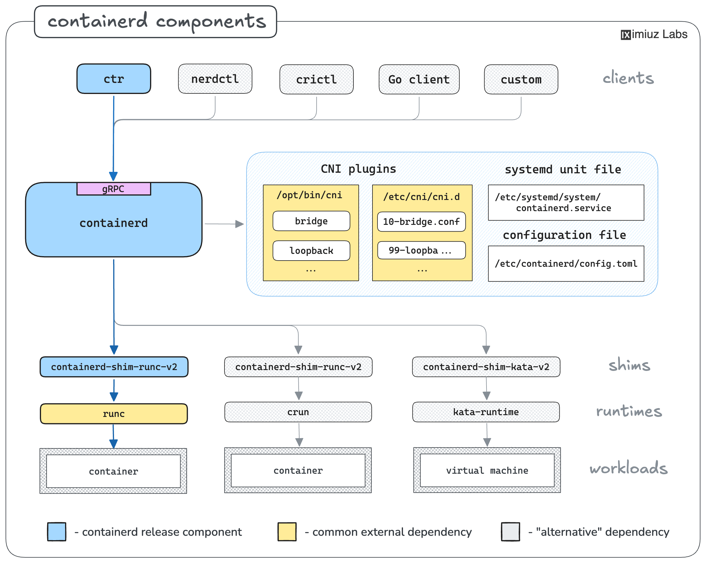

# iximuz-labs

This repository contains a collection of labs and experiments.

## Labs

*   **[L3 to L2 Networking](./labs/l3-to-l2/notes.md):** This lab explores the creation of Layer 2 networks using Linux networking primitives like network namespaces and virtual Ethernet (veth) pairs. It covers two main scenarios:
    *   **Simple L2 Bridge:** Demonstrates how to create a basic bridge connecting multiple hosts in the same broadcast domain.
    *   **VLAN-Aware Bridge:** Shows how to implement network segmentation using a single bridge and VLANs, effectively creating multiple isolated L2 networks.

    **Pain Points:** The lab highlights the complexity and manual effort required to configure these networks using `iproute2` commands. Managing namespaces, veth pairs, bridge settings, and VLAN configurations can be error-prone and difficult to scale without significant automation.

*   **[Working with Containers](./labs/containers/notes.md):** This lab provides practical notes on managing container images using `ctr`. It covers essential commands for listing, importing, mounting, and tagging images. Additionally, it delves into troubleshooting common Kubernetes issues, such as investigating killed pods by inspecting `kubelet` logs and using `crictl` to examine container states.


### Courses: How to install and Configure containerd on a linux Server

- The containerd release archive includes only the essentials components:
- ctr the command-line client
- containerd the daemon itself
- containerd-shim-runc-v2 an OCI container



To be able to run containers you need the following:
- A container runtime
- A set of CNI plugins (bridge, host-local, loopback)

### How to install runc

If you choose to install runc, it should be as simple as downloading a statically linked binary from the [GitHub Releases page](https://github.com/opencontainers/runc/releases), placing it in one of the directories in your `$PATH`, and making it executable.

For example, to install runc v1.1.12, you can use the following commands:

```bash
wget https://github.com/opencontainers/runc/releases/download/v1.1.12/runc.amd64

sudo install -m 755 runc.amd64 /usr/local/sbin/runc
```

#### Verification

After installation, you can verify that `runc` is installed and accessible by checking its version:

```bash
runc --version
```

### How to install CNI plugins

To install the CNI plugins, you can download the release binaries from the GitHub Releases page and extract them to /opt/cni/bin

```bash
wget https://github.com/containernetworking/plugins/releases/download/v1.5.1/cni-plugins-linux-amd64-v1.5.1.tgz
sudo mkdir -p /opt/cni/bin
sudo tar -C /opt/cni/bin -xzf cni-plugins-linux-amd64-v1.5.1.tgz
```

### CNI Configuration

Once the CNI plugins are installed, you need to provide a network configuration file. This file should be placed in `/etc/cni/net.d/`. For example, you can create a file named `10-bridge.conf` with the following content:

```json
{
  "cniVersion": "1.0.0",
  "name": "bridge",
  "type": "bridge",
  "bridge": "bridge0",
  "isGateway": true,
  "ipMasq": true,
  "ipam": {
    "type": "host-local",
    "ranges": [
      [{"subnet": "172.18.0.0/24"}]
    ],
    "routes": [{"dst": "0.0.0.0/0"}]
  }
}
```

This configuration does the following:
*   **`"type": "bridge"`**: Uses the `bridge` CNI plugin to create a Linux bridge.
*   **`"bridge": "bridge0"`**: Names the bridge `bridge0`.
*   **`"isGateway": true`**: Sets the bridge as a gateway for the containers.
*   **`"ipMasq": true`**: Enables IP masquerading, which allows containers to access the internet.
*   **`"ipam": { "type": "host-local" }`**: Uses the `host-local` IPAM plugin to manage IP address allocation for containers.
*   **`"ranges": [[{"subnet": "172.18.0.0/24"}]]`**: Allocates IPs from the `172.18.0.0/24` subnet.
